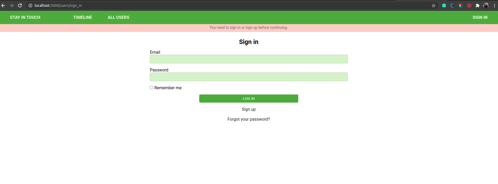
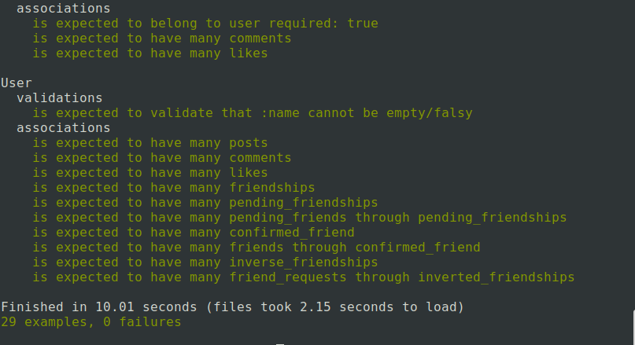

# Scaffold for social media app with Ruby on Rails

> This repo includes intial code for social media app with basic styling. Its purpose is to be a starting point for Microverse students.

<!-- PROJECT SHIELDS -->
<!--
*** I'm using markdown "reference style" links for readability.
*** Reference links are enclosed in brackets [ ] instead of parentheses ( ).
*** See the bottom of this document for the declaration of the reference variables
*** for contributors-url, forks-url, etc. This is an optional, concise syntax you may use.
*** https://www.markdownguide.org/basic-syntax/#reference-style-links
-->

<!-- PROJECT LOGO -->
<br />
<p align="center">
  <a href="https://github.com/jstloyal/social-media-app">
    
  </a>

  <h3 align="center">RoR Social Media App</h3>

  <p align="center">
    This project is part of the Microverse curriculum in Ruby on Rails module!
    <br />
    <a href="https://github.com/jstloyal/social-media-app">
      
    </a><br />
    <a href="https://github.com/jstloyal/social-media-app"><strong>Explore the docs »</strong></a>
    <br />
    <br />
    <a href="https://github.com/jstloyal/social-media-app/issues">Report Bug</a>
    <a href="https://github.com/jstloyal/social-media-app/issues">Request Feature</a>
  </p>
</p>

<!-- TABLE OF CONTENTS -->

## Table of Contents

- [About the Project](#about-the-project)
- [Contributors](#contributors)
- [Live Version](#live-version)
- [Acknowledgements](#acknowledgements)
- [License](#license)

## Built With

- Ruby v2.7.0
- Ruby on Rails v5.2.4

## Live Demo

https://rails-social-media-app.herokuapp.com/

## Getting Started

To get a local copy up and running follow these simple example steps.

### Prerequisites

Ruby: 2.6.3
Rails: 5.2.3
Postgres: >=9.5

### Setup

Instal gems with:

```
bundle install
```

Setup database with:

```
   rails db:create
   rails db:migrate
```

### Usage

Start server with:

```
    rails server
```

Open `http://localhost:3000/` in your browser.

### Run tests

```
    rpsec --format documentation
```

> Tests will be added by Microverse students. There are no tests for initial features in order to make sure that students write all tests from scratch.

<p align="center">
    <a href="https://github.com/jstloyal/social-media-app">
      
    </a><br />
</p>

### Deployment

TBA

## Authors

## Adetayo Sunkanmi

- Github: [@jstloyal](https://github.com/jstloyal)
- Twitter: [@jstloyalty](https://twitter.com/jstloyalty)
- Linkedin: [Adetayo Sunkanmi](https://www.linkedin.com/in/jstloyalty)
- E-mail: jstloyalty@gmail.com

## 🤝 Contributing

Contributions, issues and feature requests are welcome!

Feel free to check the [issues page](issues/).

## Show your support

Give a ⭐️ if you like this project!

## Acknowledgments

- [Microverse](https://www.microverse.org/)
- [Rails Documentation](https://guides.rubyonrails.org/)

## 📝 License

This project is [MIT](https://opensource.org/licenses/MIT) licensed.
